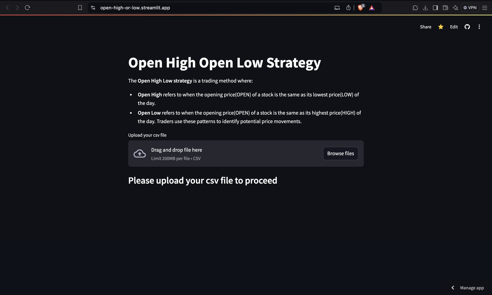

# Open High Open Low Strategy

This is a web app built using **Streamlit** that implements the **Open High Open Low** stock trading strategy. The app allows users to upload any stock data CSV file, filters out rows where the **Open price equals the High price** and **Open price equals the Low price**, and displays the results in a user-friendly format.

## Features

- Displays data where `OPEN = LOW` (Open High strategy).
- Displays data where `OPEN = HIGH` (Open Low strategy).
- Interactive and easy-to-use interface.

## How to Use

### Prerequisites

Ensure you have Python installed on your machine. If you don’t have Streamlit and pandas installed, use the following command to install them:

```bash
pip install streamlit
pip install pandas
```

#### Running the App Locally
1. Clone the repository or download the code.
2. Navigate to the directory containing app.py.
3. Start the app with the following command:

```bash
streamlit run app.py
```
4. The app will open in your default web browser, allowing you to upload a CSV file with stock data.

#### Running the Deployed App
For a quick and easy experience, you can use the deployed version of the app. This allows you to access the functionality without setting up the app on your local machine.
Access the Deployed App: Click the link below to open the app in your web browser:

[Open High Open Low Strategy](https://openhigh-or-low.streamlit.app/)

In the deployed app, you can upload your CSV file directly, and it will perform the same data filtering and display as the local version.

## Getting Real-Time Market Data

To run the Open High Open Low Strategy app with real market data, you can download stock data in CSV format from the National Stock Exchange (NSE) or Bombay Stock Exchange (BSE). Follow these steps:

### NSE (National Stock Exchange)
To download stock data from NSE:
1. Go to the [NSE website](https://www.nseindia.com/).
2. Navigate to the "Market Data" section.
3. Choose the desired index (e.g., Nifty 50, Nifty 100).
4. Download the data in CSV format.

CSV File Format


Ensure that your CSV file has the following columns (case-insensitive):

OPEN: The opening price of the stock.
LOW: The lowest price of the stock.
HIGH: The highest price of the stock.
Example CSV Format

```arduino
SYMBOL,OPEN,LOW,HIGH
TCS,3500,3480,3520
INFY,1500,1490,1510
RELIANCE,2400,2380,2410
```

What the App Does

Open High: Displays rows where the OPEN price equals the LOW price.

Open Low: Displays rows where the OPEN price equals the HIGH price.


#### Screenshot




#### Technologies Used

Streamlit: For building the web app.

Pandas: For data manipulation and filtering.

